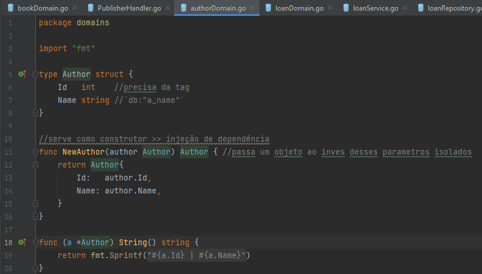

# Aplicação prática da Arquitetura Hexagonal

## Divisão Geral

<p> <center> Figura 1: Estruturação dos principais diretórios da Arquitetura Hexagonal </center> </p>   
   
    
* ```domain```: repressentação das entidades. Nela, criamos as ```structs```, os ```construtores``` e uma eventual ```String()```.

   <p> <center> Figura 2: Estruturação de um arquivo na domain. </center> </p>   
   

