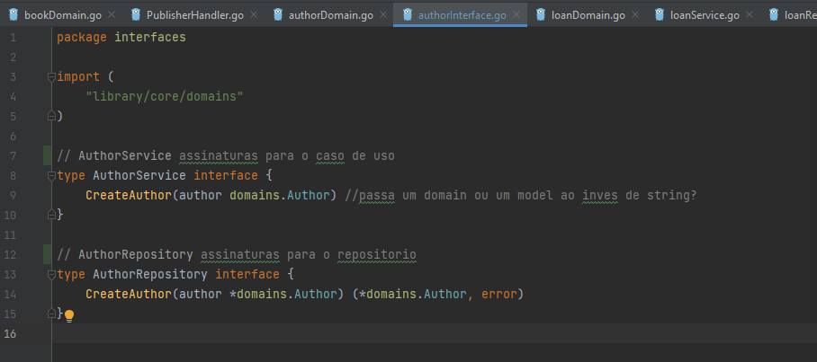

# Aplicação prática da Arquitetura Hexagonal

## Divisão Geral

<p> <center> Figura 1: Estruturação dos principais diretórios da Arquitetura Hexagonal </center> </p>   
   
    
### Domains
* ```domain```: repressentação das entidades. Nela, criamos as ```structs```, os ```construtores``` e uma eventual ```String()```.

   <p> <center> Figura 2: Estruturação de um arquivo na domain. </center> </p>   
   

### Interfaces (portas)
* ```interface```: contém as ```assinaturas dos métodos``` que são usados pelos ```adaptadores``` . Nela, declaramos as portas para o ```service``` (caso de uso) primário (atrelado ao usuário) e para o ```repositórios``` (secundárias).

   <p> <center> Figura 3: Estruturação de um arquivo na interface. </center> </p>   
   
    
### 
