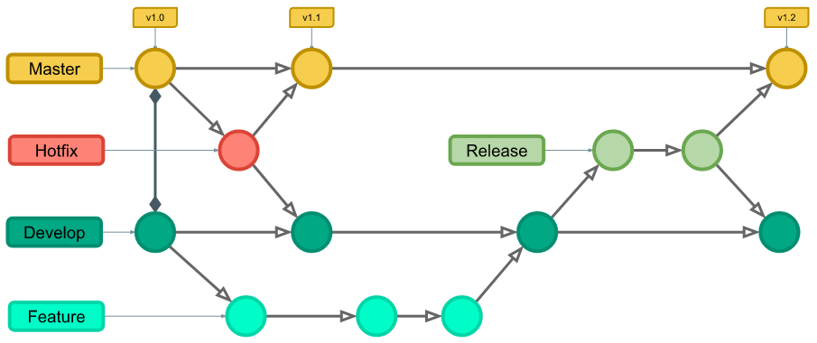

# Git Flow

## O que é?

O git flow trata-se de uma estratégia de organização em projetos que envolve vários contribuintes, estes trabalhando simultaneamente, e determina um padrão de nomenclaturas de relacionamento entre branches a fim de manter um fluxo de trabalho.  Ou seja, é um fluxo de trabalho padronizado que dita regras de relacionamento entre branches. 

* Git Hub Flow: Fluxo simplificado do git flow o qual possui uma branch ``master`` e cada vez que algo diferente for implementado no código, será criada uma ``feature`` e, ao final do projeto, as features são mescladas à branch master. Nessa versão simplificada há, ainda, a opção de criar um ``bugfix`` caso haja eventuais problemas na master uma vez que efetuada a meschagem feature-master citada anteriormente, no intuito de resolver nela tais problemas. 

> *Esse fluxo simplificado é utilizado somente em aplicações pequenas.*

## Estrutura

A estruturação se dá a partir de 5 branches principais:

* Master/Main: onde nasce o projeto.
  * Hotfix: correção de erros
  * Releases: ambiente de homologação; ponte entre a develop e a master.
* Devlop: possui funcionalidades que ainda não foram publicadas, recebe todas as features desenvolvidas.
  * Features: desenvolvimento de funcionalidades específicas.

As branches master e develop são fixas e irão existir no projeto independente das alterações implementadas. As outras três - as branches de suporte -, no entanto, permanecerão apenas enquanto houver modificações a serem feitas, ou seja, são criadas e excluídas conforme utilizadas, quando estiver "tudo ok" no projeto, elas são excluídas. A hotfix, por exceção, é a única criada diretamente da origem (branch Master) e mergeada a ela e a develop depois que finalizada, servindo para realizar correções imediatas encontradas no sistema em produção.

A branch Master armazena o histórico da implementação inicial, e a Develop serve como uma "ramificação de integração para recursos". "É ideal que todos os commits na branch Master sejam marcados com um número de versão."

<p><center> Figura: Estruturação - Git Flow</center></p>   
   
    
Fonte da imagem: [Git Flow: entenda o que é, como e quando utilizar](https://www.alura.com.br/artigos/git-flow-o-que-e-como-quando-utilizar?gclid=Cj0KCQjw39uYBhCLARIsAD_SzMT_8bWIS5VubshZ7py0T_ouxBDqes9PD75bNLbZ_Va8pPgGO3ZLTQAaAvhIEALw_wcB)

> NOTA: Para utilizar o Git Flow primeiro instala-s o Git.  

## Git Flow na prática

Visando uma melhor organizazação, você pode, inicialmente, criar um repositório no Git Hub (seja pelo terminal ou manualmente pelo próprio Git Hub) e clonar o repositório na IDE a qual vocÊ está utilizando para que o fluxo Git Flow se dê por salvo.

Para inicializar o repositório, utiliza-se o comando: ``git init nome_do_repositório``

Ou, caso já esteja no repositório em questão, seta-se o comando seguinte para inicializar o Git Flow.

``git flow init``

Irão aparecer sujestões de nomes para as branches de produção (master), de release, etc. Basta dar enter para aceitar os nomes, por padrão, sugeridos.

Ao finalizar, as branches master e develop já irão ser criadas e,automaticamente, você se encontra na dev. Para certificar-se disso, das branches já criadas, basta setar o comando: ``git branch``.

Como as funcionalidades não são desenvolvidas dentro da dev, mas sim nas features, para cada funcionalidade é preciso criar uma nova feature. Isso pode ser feito através do comando: 

``git flow feature start <nome da branch feature>``

Por exemplo (tendo como base a fncionalidade de soam de uma calculadora):

``git flow feature start soma``

Caso queira adicionar um arquivo na branch, utilize ``touch <nome do arquivo>`` para criar o arquivo, ``git add .`` para adicioná-lo e ``git commit -m 'mensagem'`` para comitar. 

Uma vez que as funcionalidades foram desenvolvidas, para finalizar a feature, utiliz-se o comando: 

``git flow feature finish <nome>``

O mesmo passo anterior serve para as releases.

Para criar, seta:

``git flow release start <nome ouversão da release>``

E para finalizar:

``git flow release finish <nome>``

Para sair da mensagem de merge ao finalizar a release seta os seguintes comandos:

```
Ctrl+c
:wq!
Enter
```

Agora, para salvar as alterações realizadas no repositório, basta fazer commit e efetuar o push. 

### Material de apoio:

> Using git-flow to automate your git branching workflow: https://jeffkreeftmeijer.com/git-flow/

> Git flow na prática: https://youtu.be/wzxBR4pOTTs

> Trabalhando em equipe com git flow: https://youtu.be/394mc6PV8t8

> Git Flow: entenda o que é, como e quando utilizar: [https://www.alura.com.br/artigos/git-flow-o-que-e-como-quando-utilizar](https://www.alura.com.br/artigos/git-flow-o-que-e-como-quando-utilizar?gclid=Cj0KCQjw39uYBhCLARIsAD_SzMT_8bWIS5VubshZ7py0T_ouxBDqes9PD75bNLbZ_Va8pPgGO3ZLTQAaAvhIEALw_wcB)

> Gitflow Workflow: [https://www.atlassian.com/git/tutorials](https://www.atlassian.com/git/tutorials/comparing-workflows/gitflow-workflow)
